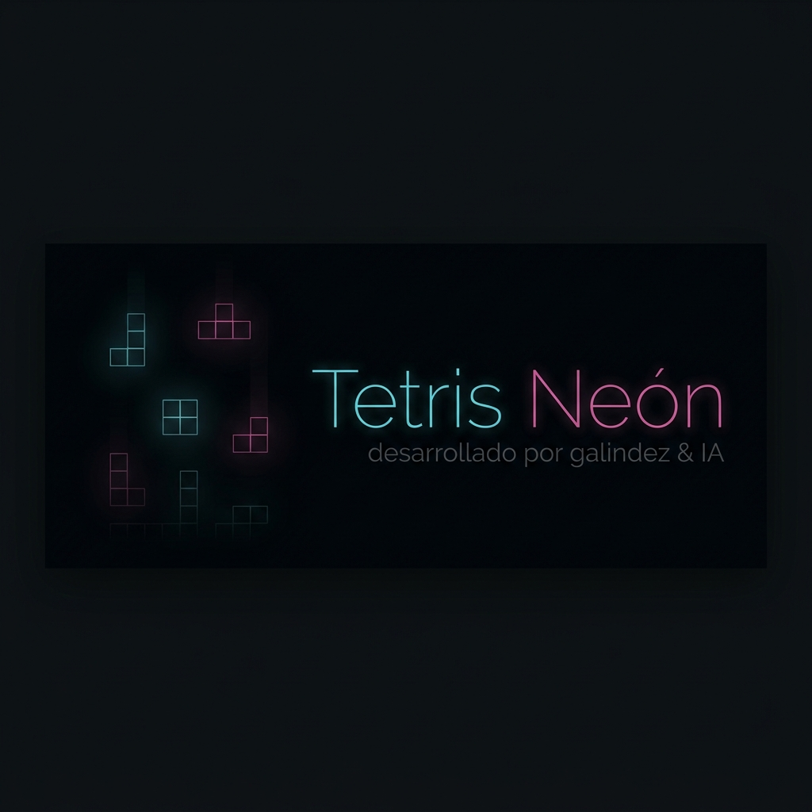

<div align="center">
  
  
  # 🕹️ Tetris Neón
  
  **Una reimaginación cyberpunk del legendario juego de bloques.**
  
  [**🎮 JUEGA AHORA EN VIVO**](https://tetris-neon-app-url-placeholder)

</div>

---

## 🌟 Descripción

**Tetris Neón** rediseña la clásica experiencia de puzles con una moderna estética **cyberpunk oscuro (Dark Mode)**, bloques de neones iluminados y una mecánica progresiva. Desarrollado con velocidad y respuesta ultrarrápida en mente, cuenta con soporte híbrido para computadoras de escritorio y dispositivos móviles mediante un D-pad interactivo y deslizamientos en pantalla, acompañado de una banda sonora electrónica integrada.

El proyecto incorpora animaciones fluidas, previsualización de la siguiente pieza y un sistema inmersivo de pausas y reanudaciones.

## 🚀 Arquitectura del Proyecto

El sistema está construido bajo los siguientes modernos estándares tecnológicos:

- **Framework y UI**: 
  - Desarrollado como una *Single Page Application (SPA)*.
  - Basado en los _Hooks_ y ciclos de vida avanzados de **React 19**, construido con **Vite** para una inyección de dependencias instantánea.
  - Tipado de datos estricto definido de forma nativa en **TypeScript**.
  - Estilizado utilizando **Tailwind CSS V4** (efectos *glassmorphism* radiales e iluminación LED) suplementado con visuales suaves por **Motion**.
  
- **Motor Gráfico e Interactividad**:
  - Un bucle de renderizado optimizado basado en `requestAnimationFrame` que interactúa en tiempo real sobre el lienzo `<canvas>`.  
  - Se implementa un manejador singular de Inputs (`inputHandler.js`) para coordinar la superposición entre toques de pantallas táctiles y teclado físico, impidiendo scroll indeseado y lag de pulsación (Soft Drop y Hard Drop).
  
- **Persistencia de Datos**:
  - Conexión por API Rest configurada sin servidor backend vía `SheetDB` para registrar y calcular competitivamente los Tops Mundiales permanentemente a través de la web; operando también con respaldo preventivo mediante el uso de `localStorage` para almacenamiento persistente del mismo dispositivo.

- **Infraestructura y Despliegue Automático (CI/CD)**:
  - Totalmente adaptado para estar alojado en la nube con un `Dockerfile` multietapa liviano. Empaquetado a través de Node Alpine y expuesto permanentemente gracias a **Nginx** redirigido universalmente al puerto dinámico `8080`.
  - Preparado para las instancias auto-escalables con 0-in-Idle en entornos del estilo de **Google Cloud Run**.

## 🕹️ Cómo Jugar

1. **Escritorio**: 
   - Utiliza la **Flecha Izquierda / Derecha** para deslizar la pieza. 
   - **Flecha Arriba** para rotarla. 
   - **Flecha Abajo** para una caída suave (Soft Drop).
   - **Barra Espaciadora** para anclarla inmediatamente (Hard Drop).
   - **P** para pausar/reanudar y **R** para reiniciar la partida.
2. **Móviles**: Disfruta del D-pad integrado bajo el tablero o utiliza las mecánicas de *Swipe* deslizando tu dedo en las direcciones hacia donde quieras incidir visualmente en la pantalla principal de la malla.
3. El reproductor musical tiene controles en la parte inferior para mutear/desmutear y pausar el ritmo sin pausar tu juego completamente si así lo deseas. 

## ⚙️ Correr en Local (Desarrollo)

Siga estas instrucciones para levantar el servidor y visualizar el proyecto en su máquina:

**Requisitos Previos:** Asegúrate de tener instalado en tu computadora **Node.js** (versión 18+ recomendada) y Git.

1. **Clonar e Ingresar al directorio del juego**:
   ```bash
   git clone https://github.com/tu-usuario/JuegoTetris.git
   cd JuegoTetris
   ```

2. **Instalar Dependencias Base**:
   ```bash
   npm install
   ```

3. **Ejecutar el Servidor Ligero de Vite**:
   ```bash
   npm run dev
   ```

4. **Visualizar el Proyecto**:
   Abre una pestaña en tu navegador web y dirígete a la ruta local arrojada por terminal, generalmente [http://localhost:3000](http://localhost:3000) (o el puerto subsecuente).

## 📜 Licencia y Créditos

Proyecto desarrollado por **Galindez & IA**. Toda la banda sonora preenlazada y recursos auditivos implementados han sido tomados explícitamente y sin necesidad de derechos de copyright para favorecer un código libre y público.
